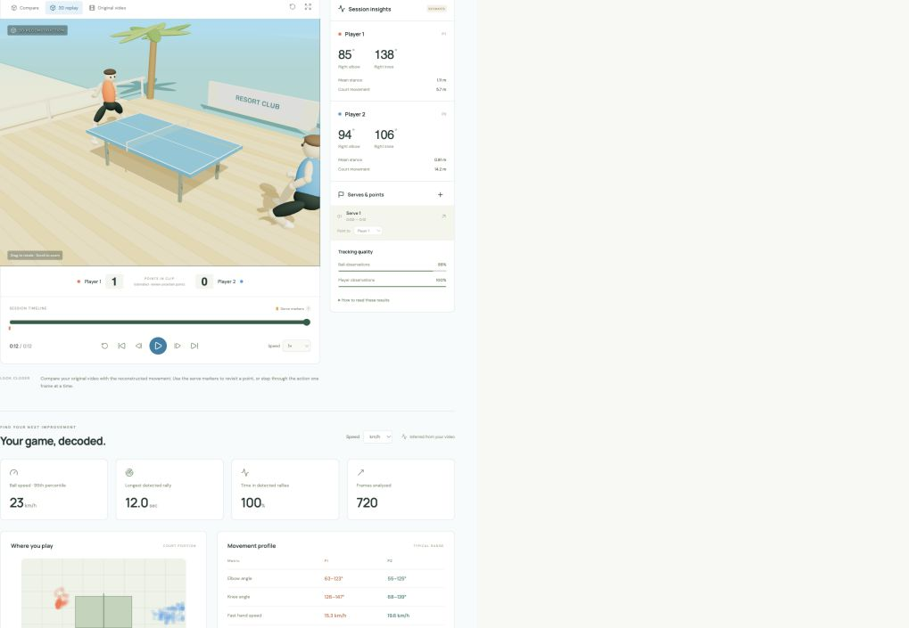
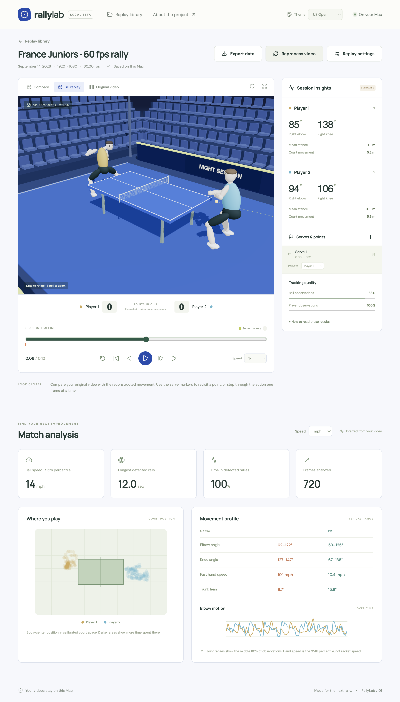

# RallyLab

Local table tennis video analysis and interactive 3D replays for Mac.

**1080p · 60 fps minimum · All analysis stays local**

Import a match, review player mechanics and ball tracking, revisit serves, and save the replay. Includes six environments, solid avatars, score review, playback speeds, and km/h ↔ mph controls.

```sh
bun install --frozen-lockfile
bun run setup
bun run samples
bun run dev
```

[Install & local setup](documentation/install.md) · [Architecture](documentation/architecture.md) · [Verification](docs/verification/README.md) · [License](docs/legal/LICENSE)

<details>
<summary>Match analytics</summary>



</details>

<details>
<summary>3D replay · US Open environment</summary>



</details>

Reconstruction and scoring are estimates. Tracking refinement is ongoing; compare with the original video and review uncertain results.
