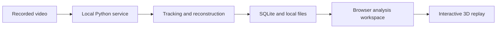

# High-level architecture

RallyLab is a local application with three parts:

## Local service

The service validates input quality, prepares browser-compatible playback, schedules analysis, and stores replay data. It binds to the local machine. Videos and model inference are not sent to a cloud analysis service.

## Analysis

Separate models handle player detection, identity persistence, body pose, and ball tracking. Camera calibration relates observations to the table. Visible body joints are constrained by their image positions; inferred depth and leg constraints supply the hidden geometry. Confidence-aware temporal processing reduces noise and retains short occlusions without assigning a spectator to a missing player.

A single camera cannot directly measure all depths. Reconstruction therefore keeps uncertainty explicit. Scores and serve markers are candidates that can be reviewed. Hidden joints and unsupported ball heights are not treated as ground-truth measurements.

## Browser workspace

The browser reads saved analysis, provides playback and review tools, and renders reusable articulated avatars. Interpolation, placement constraints, and stable meshes keep the display continuous and prevent visual geometry errors. Themes change the presentation and environment without changing the underlying observations.

## Storage and boundaries

SQLite stores replay metadata and analysis. The local data directory holds original videos, playback copies, thumbnails, and model assets. Public source code and screenshots are separate from local user data. Configuration and user edits cross validated API boundaries.

Implementation details can change without altering these responsibilities. Keep analysis, persistence, and presentation separate.
